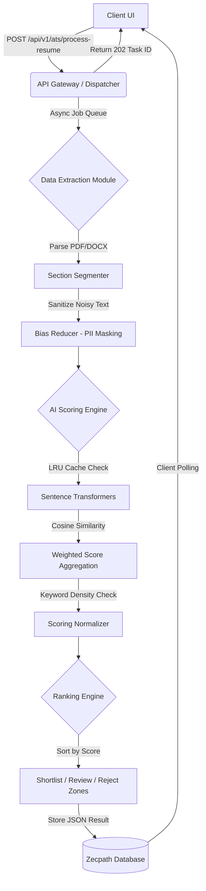

# Zecpath ATS: Architecture Diagram

The flowchart below visualizes the asynchronous resume processing pipeline from client upload to final ranked output.

```mermaid
graph TD
    A[Client UI] -->|POST /api/v1/ats/process-resume| B(API Gateway / Dispatcher)
    B -->|Return 202 Task ID| A
    B -->|Async Job Queue| C{Data Extraction Module}
    C -->|Parse PDF/DOCX| D[Section Segmenter]
    D -->|Sanitize Noisy Text| E[Bias Reducer - PII Masking]
    E --> F{AI Scoring Engine}
    F -->|LRU Cache Check| G[Sentence Transformers]
    G -->|Cosine Similarity| H[Weighted Score Aggregation]
    H -->|Keyword Density Check| I[Scoring Normalizer]
    I --> J{Ranking Engine}
    J -->|Sort by Score| K[Shortlist / Review / Reject Zones]
    K -->|Store JSON Result| L[(Zecpath Database)]
    L -->|Client Polling| A
```
